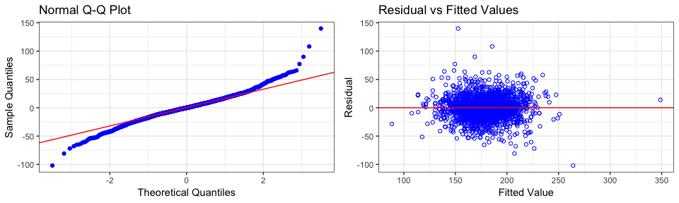
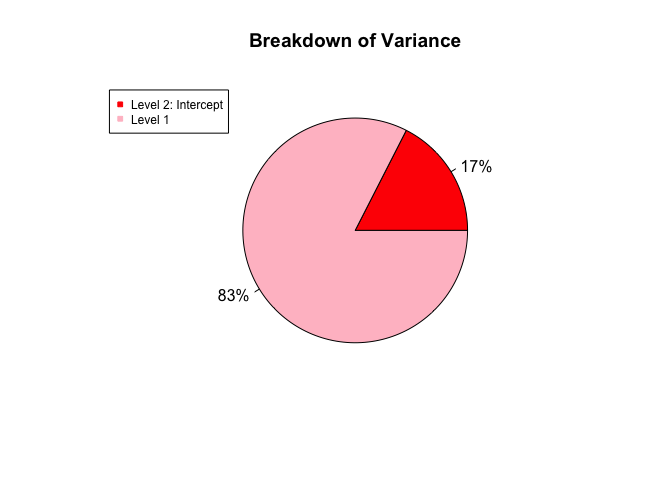
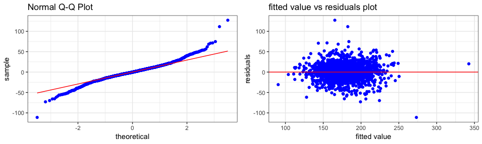

Thesis: Cancer Mortality Rate of each County in the United States
================
Jianwen Wu

### 1. INTRODUCTION

Cancer has major impact on society in the world. Many researchers around the world has conducted many research to come up treatment plans to deal with cancer. One of most frequently used measurement for researchers or doctors to track the progress of cancer is Cancer Mortality Rate(Cancer Death Rate). It describes the number of people who die from cancer out of 100,000 people in 1 year. According to National Cancer Institute, the number of cancer deaths (cancer mortality) is 163.5 per 100,000 men and women per year (based on 2011–2015 deaths). In the previous paper "Poisson Regression in Mapping Cancer Mortality" by Marta N.Vacchino, the author aims to map standardized mortality ratios of specific cancers in Argentina and to use Poisson regression to find some ecological relationships. In this paper, I used author Marta N.Vacchino's Paper as reference to analyze and fitted multiple statistical models to predict the cancer mortality rate for each county at the United States. The purpose are to find the factors can affect the cancer mortality rate and to find best statistical models to predict the cancer mortality rate.

### 2. MATERIALS

#### 2.1 Cancer Data

The cancer data is from Data World. According to Data World, these data were aggregated from a number of sources including the American Community Survey (census.gov), clinicaltrials.gov, and cancer.gov. The data set contains 3,047 county in the U.S. with the cancer mortality rate during 2010 through 2016. The mortality rate range are from 59.7 to 362.8.

There are 31 numerical variables and 1 categorical variable in the dataset. The variables studied were incidence rate, median income, percentage of race(white, black, asian, ect), percentage of education levels(high school, college), and ects. The target variable is mortality rate(death rate).

#### 2.2 Quality of the Data

There are three variables contain missing value, which are "pctsomecol18\_24", "pctprivatecoveragealone", and "pctemployed16\_over". The percentage of missing in these variables are 75%, 20% and 5% respectively. The missing value of these variables might have huge effect on our statistical models. It might consisder to remove those variables for modeling.

There are also some variables are multicollinearity. Multicollinearity(predictors are highly correlated) is bad for linear regression and it should be removed.

#### 2.3 Population

The population for 3,047 counties in the U.S. are obtained from the census 2015. The Los Angeles County, California has higgest population 10,170,292 among those counties and Golden Valley County, Montana has the lowest population 827.

### 3. STATISTICAL ANALYSIS

We split the data into 70 percent training and 30 percent testing. We used the training data to fit multiple statistical models and used testing data to evaluate the results.

We used the following model to fit the data:

-   Multiple Linear Regression

-   Scaled Poisson Regression

-   Logistics Regression

-   Multilevel Regression - Random Intercept

**Key Note** - For scaled poisson regression and logistics regression, we rounded our target variable deathrate(mortality rate) into whole number. For example, we converted deathrate 164.9 for Kitsap County, Washington into 165. The reason is these two model only works with whole number.

**Target Variable DeathRate** - Mean per capita (100,000) cancer mortalities(a)

##### 3.1 Variables Selection

The R package `olsrr` was used for stepwise forward selection and stepwise backward selection. The purpose was to reduce number of variables for modeling. The variables was chose base on the P value. For stepwise forward selection, variables with P value less than 0.05 will enter into the model. For stepwise backward selection, variables with P value more than 0.05 will be removed from the model.

Variables Selection Table:

<table style="width:81%;">
<colgroup>
<col width="40%" />
<col width="40%" />
</colgroup>
<thead>
<tr class="header">
<th align="center">Stepwise Forward Selection</th>
<th align="center">Stepwise Backward Selection</th>
</tr>
</thead>
<tbody>
<tr class="odd">
<td align="center">pctbachdeg25_over</td>
<td align="center">incidencerate</td>
</tr>
<tr class="even">
<td align="center">incidencerate</td>
<td align="center">medianagemale</td>
</tr>
<tr class="odd">
<td align="center">povertypercent</td>
<td align="center">percentmarried</td>
</tr>
<tr class="even">
<td align="center">pcths18_24</td>
<td align="center">pctnohs18_24</td>
</tr>
<tr class="odd">
<td align="center">pctotherrace</td>
<td align="center">pctsomecol18_24</td>
</tr>
<tr class="even">
<td align="center">pctmarriedhouseholds</td>
<td align="center">pctbachdeg18_24</td>
</tr>
<tr class="odd">
<td align="center">medianagefemale</td>
<td align="center">pcths25_over</td>
</tr>
<tr class="even">
<td align="center">birthrate</td>
<td align="center">pctemployed16_over</td>
</tr>
<tr class="odd">
<td align="center">pctunemployed16_over</td>
<td align="center">pctunemployed16_over</td>
</tr>
<tr class="even">
<td align="center">percentmarried</td>
<td align="center">pctprivatecoverage</td>
</tr>
<tr class="odd">
<td align="center">pcths25_over</td>
<td align="center">pctempprivcoverage</td>
</tr>
<tr class="even">
<td align="center">pctemployed16_over</td>
<td align="center">pctotherrace</td>
</tr>
<tr class="odd">
<td align="center">pctempprivcoverage</td>
<td align="center">pctmarriedhouseholds</td>
</tr>
<tr class="even">
<td align="center">pctprivatecoverage</td>
<td align="center">-</td>
</tr>
<tr class="odd">
<td align="center">pctwhite</td>
<td align="center">-</td>
</tr>
<tr class="even">
<td align="center">pctnohs18_24</td>
<td align="center">-</td>
</tr>
</tbody>
</table>

There are total 32 variables in the dataset. Based on the variables selection table above, the stepwise forward selection method chose 16 important variables of 32 variables and the stepwise back selection method chose 13 important variables of 32 variables. I decided to choose 17 variables from both methods.

The final variables for modeling are list below:

<table>
<colgroup>
<col width="26%" />
<col width="30%" />
<col width="42%" />
</colgroup>
<thead>
<tr class="header">
<th align="center">Equation Variable</th>
<th align="center">Variables</th>
<th align="center">Defintion</th>
</tr>
</thead>
<tbody>
<tr class="odd">
<td align="center">X_1</td>
<td align="center">incidencerate</td>
<td align="center">Mean per capita (100,000) cancer diagoses</td>
</tr>
<tr class="even">
<td align="center">X_2</td>
<td align="center">povertypercent</td>
<td align="center">Percent of populace in poverty</td>
</tr>
<tr class="odd">
<td align="center">X_3</td>
<td align="center">pctwhite</td>
<td align="center">Percent of county residents who identify as White</td>
</tr>
<tr class="even">
<td align="center">X_4</td>
<td align="center">pctblack</td>
<td align="center">Percent of county residents who identify as Black</td>
</tr>
<tr class="odd">
<td align="center">X_5</td>
<td align="center">pctasian</td>
<td align="center">Percent of county residents who identify as Asian</td>
</tr>
<tr class="even">
<td align="center">X_6</td>
<td align="center">pctotherrace</td>
<td align="center">Percent of county residents who identify in a category which is not White, Black, or Asian</td>
</tr>
<tr class="odd">
<td align="center">X_7</td>
<td align="center">pctnohs18_24</td>
<td align="center">Percent of county residents ages 18-24 highest education attained: less than high school</td>
</tr>
<tr class="even">
<td align="center">X_8</td>
<td align="center">pcths18_24</td>
<td align="center">Percent of county residents ages 18-24 highest education attained: high school diploma</td>
</tr>
<tr class="odd">
<td align="center">X_9</td>
<td align="center">pctbachdeg18_24</td>
<td align="center">Percent of county residents ages 18-24 highest education attained: bachelor’s degree</td>
</tr>
<tr class="even">
<td align="center">X_10</td>
<td align="center">pcths25_over</td>
<td align="center">Percent of county residents ages 25 and over highest education attained: high school diploma</td>
</tr>
<tr class="odd">
<td align="center">X_11</td>
<td align="center">pctbachdeg25_over</td>
<td align="center">Percent of county residents ages 25 and over highest education attained: bachelor’s degree</td>
</tr>
<tr class="even">
<td align="center">X_12</td>
<td align="center">percentmarried</td>
<td align="center">Percent of county residents who are married</td>
</tr>
<tr class="odd">
<td align="center">X_13</td>
<td align="center">pctunemployed16_over</td>
<td align="center">Percent of county residents ages 16 and over unemployed</td>
</tr>
<tr class="even">
<td align="center">X_14</td>
<td align="center">pctempprivcoverage</td>
<td align="center">Percent of county residents with private health coverage</td>
</tr>
<tr class="odd">
<td align="center">X_15</td>
<td align="center">pctpubliccoverage</td>
<td align="center">Percent of county residents with government-provided health coverage</td>
</tr>
<tr class="even">
<td align="center">X_16</td>
<td align="center">medianage</td>
<td align="center">Median age of county residents</td>
</tr>
<tr class="odd">
<td align="center">X_17</td>
<td align="center">medincome</td>
<td align="center">Median income per county</td>
</tr>
</tbody>
</table>

##### 3.2 Multiple Linear Regression

**The Respond Function:**

*E*{*d**e**a**t**h**r**a**t**e*}=0.192364*X*<sub>1</sub> + 1.052610*X*<sub>2</sub> − 0.189031*X*<sub>3</sub> − 0.060035*X*<sub>4</sub> − 0.010414*X*<sub>5</sub> − 0.665450*X*<sub>6</sub> − 0.159103*X*<sub>7</sub> + 0.334112*X*<sub>8</sub> − 0.051459*X*<sub>9</sub> + 0.377054*X*<sub>10</sub> − 1.211594*X*<sub>11</sub> + 0.067382*X*<sub>12</sub> + 0.728017*X*<sub>13</sub> + 0.290009*X*<sub>14</sub> + 0.107784*X*<sub>15</sub> − 0.008915*X*<sub>16</sub> − 0.000046*X*<sub>17</sub> + 64.588820

Based the regression result from table 1 in appendix, the following variables are statistical significance:

-   **incidencerate** - it has positive effect on the deathrate. As incidence rate increases 1 unit, the deathrate increases 0.192364. Holding other variables constant.

-   **povertypercent** - it has positive effect on the deathrate. As povertypercent increases 1 unit, the deathrate increases 1.052610. Holding other variables constant.

-   **pctwhite** - it has negative effect on the deathrate. As pctwhite increases 1 unit, the deathrate decreases 0.189031. Holding other variables constant.

-   **pctotherrace** - it has negative effect on the deathrate. As pctotherrace increases 1 unit, the deathrate decreases 0.665450. Holding other variables constant.

-   **pctnohs18\_24** - it has negative effect on the deathrate. As pctnohs18\_24 increases 1 unit, the deathrate decreases 0.159103.

-   **pcths18\_24** - it has positive effect on the deathrate. As pcths18\_24 increases 1 unit, the deathrate increases 0.334112. Holding other variables constant.

-   **pcths25\_over** - it has positive effect on the deathrate. As pcths25\_over increases 1 unit, the deathrate increases 0.377054. Holding other variables constant.

-   **pctbachdeg25\_over** - it has negative effect on the deathrate. As pctbachdeg25\_over increases 1 unit, the deathrate decreases 1.211594. Holding other variables constant.

-   **pctunemployed16\_over** - it has positive effect on the deathrate. As pctunemployed16\_over increases 1 unit, the deathrate increases 0.728017. Holding other variables constant.

-   **pctempprivcoverage** - it has positive effect on the deathrate. As pctempprivcoverage increases 1 unit, the deathrate increases 0.290009. Holding other variables constant.

For the educational variables("pctnohs18\_24", "pcths18\_24"), they did not follow my initial assumption that higher educational background the lower deathrate. In the regression mode, increases "pctnohs18\_24" lead to decreases deathrate, while increases "pcths18\_24" lead to increases deathrate.

For the educational variables("pcths25\_over", "pctbachdeg25\_over"), they did follow my initial assumption that higher educational background the lower deathrate.

For the variables "pctempprivcoverage" did not make sense to me as well. The model indicated increases in these variable will increases deathrate. If we have higher "pctempprivcoverage" in each county, the deathrate should be lower.

**Model Diagnostics:**

Linear regression model assumptions:

-   The errors has normal distribution
-   The errors has mean 0
-   Homoscedasticity of errors or equal variance
-   The errors are independent.



Normal Q-Q Plot:

-   The residual points roughly lie within the lines and suggests that the error terms are indeed normally distributed.

Residual vs Fitted Values:

-   The residuals spread randomly around the 0 line indicating that the relationship is linear.

-   The residuals roughly horizontal band around the 0 line indicating homogeneity of error variance.(constant variance)

-   No residuals are away from random pattern of residuals indicating no outliers.

Therefore, it met assumptions of the linear regression model and our linear regression model is valid.

##### 3.4 Scaled Poisson Regression

The poisson regression is a generalized linear model form of regression analysis used to model count data. There are many commonly used functions for poisson regression.

*Y*<sub>*i*</sub> = *E*{*Y*<sub>*i*</sub>}+*e*<sub>*u*</sub>
 where:

-   *i* = 1, 2, 3, ..., *n*
-   *Y*<sub>*i*</sub> = Independent poisson random variables

In this case, I would use log linear model:
*l**o**g*(*μ*)=*X*<sup>*T*</sup>*β*

where:

-   *μ* = Expected value of Y

-   *β* = regression coefficients

-   *e*<sub>*i*</sub> = error term for *i*<sub>*t**h*</sub> value

In Poisson regression, we assumed that the *V**a**r*{*Y*}=*E*{*Y*}. In our case, we know that the expect value of Y(Mortality Rate) is 178 and variance of Y(Mortality Rate) is 792. In other words, variance of Y(Mortality Rate) is greater than expect value of Y(Mortality Rate). It is clearly showed that it violated the assumption of the poisson regression and it is Overdispersion. Overdispersion happened when variance of Y is greater than expect value of Y. However, we have not considered any covariates yet. There, we performed a overdispersion test using R package `AER`.

Based on the R pakcage `ARE`, we have:

*V**a**r*{*Y*}=*c* \* *E*{*Y*}
 where:

-   c is overdispersion parameter

*H*<sub>0</sub>: c = 1 - equidispersion

*H*<sub>*a*</sub>: c &gt; 1 - overdispersion

Based on the result from table 2 in appendix, the z statistics is 10.999 with p-value &lt; 2.2e-16. Since the p-value of z statistics(10.999) is less than 0.05, we rejected the *H*<sub>0</sub> and concluded that c &gt; 1 and there is overdispersion.

Since there is overdispersion, we will use scaled poisson regression(Quasi-families) to model the mortality rate. A scaled poisson regression would add the scaled parameter *c* in the relationship between variance of Y and expected value of Y. By multiple the scaled paramter *c* to *E*{*Y*}, it will fix the overdispersion.

*V**a**r*{*Y*}=*c* \* *E*{*Y*}

**The Respond Function**

*E*{*d**e**a**t**h**r**a**t**e*}=0.001*X*<sub>1</sub> + 0.004729*X*<sub>2</sub> − 0.001217*X*<sub>3</sub> − 0.000437*X*<sub>4</sub> − 0.000082*X*<sub>5</sub> − 0.003909*X*<sub>6</sub> − 0.001080*X*<sub>7</sub> + 0.001686*X*<sub>8</sub> − 0.000430*X*<sub>9</sub> + 0.002088*X*<sub>10</sub> − 0.007388*X*<sub>11</sub> + 0.000278*X*<sub>12</sub> + 0.004059*X*<sub>13</sub> + 0.001930*X*<sub>14</sub> + 0.000886*X*<sub>15</sub> − 0.000047*X*<sub>16</sub> − 0.000001*X*<sub>17</sub> + 4.631321

Based on the result from table 3 in appendix, we have scaled parameter c = 2.182974, and the following variables are statistical significance:

-   **incidencerate** - Increases incidencerate by one unit, the difference in the logs of expected counts would be expected to increase by 0.001 unit, while holding the other variables in the model constant.

-   **povertypercent** - Increases povertypercent by one unit, the difference in the logs of expected counts would be expected to increase by 0.004729 unit, while holding the other variables in the model constant.

-   **pctwhite** - Increases pctwhite by one unit, the difference in the logs of expected counts would be expected to decrease by 0.001217 unit, while holding the other variables in the model constant.

-   **pctotherrace** - Increases pctotherrace by one unit, the difference in the logs of expected counts would be expected to decrease by 0.003909 unit, while holding the other variables in the model constant.

-   **pctnohs18\_24** - Increases pctnohs18\_24 by one unit, the difference in the logs of expected counts would be expected to decrease by 0.001080 unit, while holding the other variables in the model constant.

-   **pcths18\_24** - Increases pcths18\_24 by one unit, the difference in the logs of expected counts would be expected to increase by 0.001686 unit, while holding the other variables in the model constant.

-   **pcths25\_over** - Increases pcths25\_over by one unit, the difference in the logs of expected counts would be expected to increase by 0.002088 unit, while holding the other variables in the model constant.

-   **pctbachdeg25\_over** - Increases pctbachdeg25\_over by one unit, the difference in the logs of expected counts would be expected to decrease by 0.007388 unit, while holding the other variables in the model constant.

-   **pctunemployed16\_over** - Increases pctunemployed16\_over by one unit, the difference in the logs of expected counts would be expected to increase by 0.004059 unit, while holding the other variables in the model constant.

-   **pctempprivcoverage** - Increases pctempprivcoverage by one unit, the difference in the logs of expected counts would be expected to increase by 0.001930 unit, while holding the other variables in the model constant.

Both scaled poisson regression and multiple linear regression have the exact same signicant variables. For the variables "pctnohs18\_24", and "pcths18\_24" did not follow my inital assumption that higher educational backgroup, the lower deathrate. In the model, as increases in "pctnohs18\_24" will lead to decrease deathrate. Also, as increases in "pcths18\_24" will lead to increase deathrate. For the variables "pctempprivcoverage" did not make sense to me as well. The model indicated those two variables will increases deathrate. If we have higher "pctempprivcoverage" in each county, the deathrate should be lower.

##### 3.3 Logistics Regression

Logistics Regression is statistcal model uses logistics function to model data that are binary or fractions that represent the number of successes out of n trials. We would use logistics regression to model probability of people died from cancer based on the mortality rate out of 100,000 people in each county.

**The Respond Function**

$$E\\{deathrate\\} = \\frac{exp(X\\beta)}{1 + exp(X\\beta)}$$
 Where:

-   *X**β* = *e**x**p*(0.001002*X*<sub>1</sub> + 0.004739*X*<sub>2</sub> − 0.001218*X*<sub>3</sub> − 0.000437*X*<sub>4</sub> − 0.000082*X*<sub>5</sub> − 0.003915*X*<sub>6</sub> − 0.001082*X*<sub>7</sub> + 0.001689*X*<sub>8</sub> − 0.000430*X*<sub>9</sub> + 0.002091*X*<sub>10</sub> − 0.007400*X*<sub>11</sub> + 0.000279*X*<sub>12</sub> + 0.004067*X*<sub>13</sub> + 0.001933*X*<sub>14</sub> + 0.000887*X*<sub>15</sub> − 0.000047*X*<sub>16</sub> − 0.000001*X*<sub>17</sub> − 6.880999)

Based on the result from table 3 in appendix, the following variables are statistical significance:

-   incidencerate - Higher incidencerate in the county, more likely to have high deathrate. Hoding other variables constant.

-   povertypercent - Higher povertypercent in the county, more likely to have high deathrate. Hoding other variables constant.

-   pctwhite - Higher pctwhite in the county in the county, less likely to have high deathrate. Hoding other variables constant.

-   pctotherrace - Higher pctotherrace in the county, less likely to have high deathrate. Hoding other variables constant.

-   pctnohs18\_24 - Higher pctnohs18\_24 in the county, less likely to have high deathrate. Hoding other variables constant.

-   pcths18\_24 - Higher pcths18\_24 in the county, more likely to have high deathrate. Hoding other variables constant.

-   pcths25\_over - Higher pcths25\_over in the county, more likely to have high deathrate. Hoding other variables constant.

-   pctbachdeg25\_over - Higher pctbachdeg25\_over in the county, less likely to have high deathrate. Hoding other variables constant.

-   pctunemployed16\_over - Higher pctunemployed16\_over in the county, more likely to have high deathrate. Hoding other variables constant.

-   pctempprivcoverage - Higher pctempprivcoverage in the county, more likely to have high deathrate. Hoding other variables constant.

-   pctpubliccoverage - Higher pctpubliccoverage in the county, more likely to have high deathrate. Hoding other variables constant.

Again, the variables "pctnohs18\_24" and "pcths18\_24" did not follow my initial assumption that higher educational background the lower deathrate. In the model, higher "pctnohs18\_24" lead to less likely to have high deathrate. Also, higher "pcths18\_24" lead to more likely to have high deathrate.

Both variables "pctempprivcoverage" and "pctpubliccoverage" did not make sense to me as well. The model indicated that increased in those two variables will lead to more likely to have high deathrate. It should be lead to less likely to have high deathrate.

##### 3.5 Multilevel Regression - Random Intercept

We used R package `lme4` to fit random intercept model using a grouping variable "state". We include a random intercept to account for random variation across states, so as to get more accurate estimation for the effects of the predictors.

Key Note: The dataset contains 51 states, because Washington D.C is included.

**Random Intercept Model**

*Y*<sub>*i**j*</sub> = *X**β* + *μ*<sub>*j*</sub> + *e*<sub>*i**j*</sub>

where:

-   *X**β* = 0.190581*X*<sub>1</sub> + 0.696548*X*<sub>2</sub> − 0.1984981*X*<sub>3</sub> − 0.112395*X*<sub>4</sub> + 0.062071*X*<sub>5</sub> − 0.552205*X*<sub>6</sub> − 0.084659*X*<sub>7</sub> + 0.233772*X*<sub>8</sub> − 0.126618*X*<sub>9</sub> + 0.249395*X*<sub>10</sub> − 0.969464*X*<sub>11</sub> − 0.037503*X*<sub>12</sub> + 0.736855*X*<sub>13</sub> + 0.275552*X*<sub>14</sub> + 0.331264*X*<sub>15</sub> − 0.003017*X*<sub>16</sub> − 0.000031*X*<sub>17</sub> + 71.127740

-   *μ*<sub>*j*</sub> ∼ *N*(0, *σ*<sub>*μ*</sub><sup>2</sup>) - state

-   *e*<sub>*i**j*</sub> ∼ *N*(0, *σ*<sub>*e*</sub><sup>2</sup>)

-   *X**β* is fixed part.

-   Both *μ*<sub>*j*</sub> and *e*<sub>*i**j*</sub> are random part.

Bases on the result from table 4 in appendix, the following variables are statistically significant:

-   **incidencerate** - it has positive effect on the deathrate. As incidence rate increases 1 unit, the deathrate increases 0.19. Holding other variables constant.

-   **povertypercent** - it has positive effect on the deathrate. As povertypercent increases 1 unit, the deathrate increases 0.70. Holding other variables constant.

-   **pctwhite** - it has negative effect on the deathrate. As pctwhite increases 1 unit, the deathrate decreases 0.11 Holding other variables constant.

-   **pctblack** - it has negative effect on the deathrate. As pctblack increases 1 unit, the deathrate decreases 0.20. Holding other variables constant.

-   **pctotherrace** - it has negative effect on the deathrate. As pctotherrace increases 1 unit, the deathrate decreases 0.55 Holding other variables constant.

-   **pctnohs18\_24** - it has negative effect on the deathrate. As pctnohs18\_24 increases 1 unit, the deathrate decreases 0.08. Holding other variables constant.

-   **pcths18\_24** - it has positive effect on the deathrate. As pcths18\_24 increases 1 unit, the deathrate increases 0.23. Holding other variables constant.

-   **pcths25\_over** - it has positive effect on the deathrate. As pcths25\_over increases 1 unit, the deathrate increases 0.25. Holding other variables constant.

-   **pctbachdeg25\_over** - it has negative effect on the deathrate. As pctbachdeg25\_over increases 1 unit, the deathrate decreases 0.97. Holding other variables constant.

-   **pctunemployed16\_over** - it has positive effect on the deathrate. As pctunemployed16\_over increases 1 unit, the deathrate increases 0.74. Holding other variables constant.

-   **pctempprivcoverage** - it has positive effect on the deathrate. As pctempprivcoverage increases 1 unit, the deathrate increases 0.28. Holding other variables constant.

-   **pctpubliccoverage** - it has positive effect on the deathrate. As pctpubliccoverage increases 1 unit, the deathrate increases 0.33. Holding other variables constant.

For the educational variables("pctnohs18\_24", "pcths18\_24"), they did not follow my initial assumption that higher educational background the lower deathrate. In the regression mode, increases "pctnohs18\_24" lead to decreases deathrate, while increases "pcths18\_24" lead to increases deathrate.

For the educational variables("pcths25\_over", "pctbachdeg25\_over"), they did follow my initial assumption that higher educational background the lower deathrate.

For the variables "pctempprivcoverage" and "pctpubliccoverage" did not make sense to me as well. The model indicated increases in those two variables lead to increases deathrate. If we have higher "pctempprivcoverage" and "pctpubliccoverage" in each county, the deathrate should be lower.

Based on the result from table 4 in appendix, the fixed effect explain 45% of variation of the data. However, with the random effect(state), the model explain 54% of variation of the data.

**Breakdown of Variance**



Based on the variance plot above, the variable "state" explained 17% of total variances. In indicated that "state" have big impact on the motility rate.

**Model Diagnostics:**



Normal Q-Q Plot:

-   The residual points roughly lie within the lines and suggests that the error terms are indeed normally distributed.

Residual vs Fitted Values:

-   The residuals spread randomly around the 0 line indicating that the relationship is linear.

-   The residuals roughly horizontal band around the 0 line indicating homogeneity of error variance.(constant variance)

-   There are two outliers in the data.

Therefore, it met assumptions of the linear regression model and our linear regression model is valid.

##### 3.6 Model Performances

$$MSE = \\frac{\\sum\_{}^{n}(y\_i - \\hat{y\_i})}{n}$$
 where:

-   n = total observation

-   *y*<sub>*i*</sub> = *i*<sub>*t*</sub>*h* actual deathrate

-   $\\hat{y\_i}$ = *i*<sub>*t*</sub>*h* fitted deathrate

**Performance on Training Data Table**:

<table style="width:81%;">
<colgroup>
<col width="45%" />
<col width="9%" />
<col width="12%" />
<col width="12%" />
</colgroup>
<thead>
<tr class="header">
<th align="center">models</th>
<th align="center">R2</th>
<th align="center">Adj_R2</th>
<th align="center">MSE</th>
</tr>
</thead>
<tbody>
<tr class="odd">
<td align="center">Multiple_Linear_Regression</td>
<td align="center">0.52</td>
<td align="center">0.51</td>
<td align="center">382.305</td>
</tr>
<tr class="even">
<td align="center">Scaled_poisson_regression</td>
<td align="center">0.51</td>
<td align="center">0.51</td>
<td align="center">386.038</td>
</tr>
<tr class="odd">
<td align="center">Logistics_Regression</td>
<td align="center"></td>
<td align="center"></td>
<td align="center">386.01</td>
</tr>
<tr class="even">
<td align="center">Multilevel Regression - Random Intercept</td>
<td align="center">0.54</td>
<td align="center"></td>
<td align="center">326.493</td>
</tr>
</tbody>
</table>

Based on the performance table above, we can see that Random Intercept is the best model on the training data with lowest mean square error 326.5. The random intercept model added random effect on variable "state", it indicated that variable "state" played important role.

### 4. PREDICTION

We would used the four model above to make prediction on testing data, and reported the performances.

We would use mean square error(MSE) as our performance metric:

$$MSE = \\frac{\\sum\_{}^{n}(y\_i - \\hat{y\_i})}{n}$$
 where:

-   n = total observation

-   *y*<sub>*i*</sub> = *i*<sub>*t*</sub>*h* actual deathrate

-   $\\hat{y\_i}$ = *i*<sub>*t*</sub>*h* fitted deathrate

**Multiple Linear Regression** - Made the prediction on the testing data and returned the predicted deathrate(*y*<sub>*i*</sub>) for each observation in the testing data.

**Scaled Poisson Regression** - Made the prediction on the testing data and returned the predicted logarithm of deathrate\_count for each observation in the testing data. In order to get the predicted deathrate\_count(*y*<sub>*i*</sub>), we take the exponent of logarithm of deathrate\_count(*e*<sup>*l**o**g*(*d**e**a**t**h**r**a**t**e*\_*c**o**u**n**t*)</sup>). As we mentioned before, we converted deathrate into whole number for scaled possion regression.

**Logistics Regression** - Made the prediction on the testing data and returned the predicted probability of deathrate($\\frac{predict\\\_deathrate}{100,000}$). In order to get the predicted deathrate(*y*<sub>*i*</sub>), we used the probability of deathrate times 100,000. We also converted the deathrate into whole number for logistics regression.

**Multilevel Regression - Random Intercept** - Made the prediction on the testing data and returned the predicted deathrate(*y*<sub>*i*</sub>) for each observation in the testing data.

**Performance on Testing Data Table**

<table style="width:58%;">
<colgroup>
<col width="45%" />
<col width="12%" />
</colgroup>
<thead>
<tr class="header">
<th align="center">models</th>
<th align="center">MSE</th>
</tr>
</thead>
<tbody>
<tr class="odd">
<td align="center">Multiple_Linear_Regression</td>
<td align="center">409.449</td>
</tr>
<tr class="even">
<td align="center">Scaled_poisson_regression</td>
<td align="center">410.802</td>
</tr>
<tr class="odd">
<td align="center">Logistics_Regression</td>
<td align="center">410.792</td>
</tr>
<tr class="even">
<td align="center">Multilevel Regression - Random Intercept</td>
<td align="center">340.084</td>
</tr>
</tbody>
</table>

Based on the performances table above, we can clearly see Random Intercept Model performed best on testing data with lowest MSE 340

### 5. MAPPING

**Key Note** - The lighter color of red represents lower deathrate, and darker color of red represents higher deathrate.

**Average Deathrate in each State**:


The graph above showed the average deathrate in each state in the United States. As we can see, Alaska, Kentucky and Mississippi have higher deathrate. Hawaii and Utah have lower deathrate

**New York v.s. California in County Level**:


New York and California are two of biggest state in the US. Based on the graph, we can see that there are more counties in New York has high deathrate than California(more darker red in New York).

### Appendix

**Table 1 - Multiple Linear Regression**:

<table>
<caption>Fitting linear model: target_deathrate ~ incidencerate + povertypercent + pctwhite + pctblack + pctasian + pctotherrace + pctnohs18_24 + pcths18_24 + pctbachdeg18_24 + pcths25_over + pctbachdeg25_over + percentmarried + pctunemployed16_over + pctempprivcoverage + pctpubliccoverage + medianage + medincome</caption>
<colgroup>
<col width="32%" />
<col width="17%" />
<col width="17%" />
<col width="15%" />
<col width="17%" />
</colgroup>
<thead>
<tr class="header">
<th align="center"> </th>
<th align="center">Estimate</th>
<th align="center">Std. Error</th>
<th align="center">t value</th>
<th align="center">Pr(&gt;|t|)</th>
</tr>
</thead>
<tbody>
<tr class="odd">
<td align="center"><strong>(Intercept)</strong></td>
<td align="center">64.5888</td>
<td align="center">13.4936</td>
<td align="center">4.78662</td>
<td align="center">1.81337e-06</td>
</tr>
<tr class="even">
<td align="center"><strong>incidencerate</strong></td>
<td align="center">0.192364</td>
<td align="center">0.00818832</td>
<td align="center">23.4925</td>
<td align="center">1.21284e-108</td>
</tr>
<tr class="odd">
<td align="center"><strong>povertypercent</strong></td>
<td align="center">1.05261</td>
<td align="center">0.160826</td>
<td align="center">6.54502</td>
<td align="center">7.44024e-11</td>
</tr>
<tr class="even">
<td align="center"><strong>pctwhite</strong></td>
<td align="center">-0.189031</td>
<td align="center">0.0654397</td>
<td align="center">-2.88863</td>
<td align="center">0.00390851</td>
</tr>
<tr class="odd">
<td align="center"><strong>pctblack</strong></td>
<td align="center">-0.0600349</td>
<td align="center">0.061577</td>
<td align="center">-0.974957</td>
<td align="center">0.329693</td>
</tr>
<tr class="even">
<td align="center"><strong>pctasian</strong></td>
<td align="center">-0.0104136</td>
<td align="center">0.200338</td>
<td align="center">-0.0519802</td>
<td align="center">0.958549</td>
</tr>
<tr class="odd">
<td align="center"><strong>pctotherrace</strong></td>
<td align="center">-0.66545</td>
<td align="center">0.146296</td>
<td align="center">-4.54867</td>
<td align="center">5.70389e-06</td>
</tr>
<tr class="even">
<td align="center"><strong>pctnohs18_24</strong></td>
<td align="center">-0.159103</td>
<td align="center">0.0639065</td>
<td align="center">-2.48962</td>
<td align="center">0.0128641</td>
</tr>
<tr class="odd">
<td align="center"><strong>pcths18_24</strong></td>
<td align="center">0.334112</td>
<td align="center">0.0582608</td>
<td align="center">5.73477</td>
<td align="center">1.11653e-08</td>
</tr>
<tr class="even">
<td align="center"><strong>pctbachdeg18_24</strong></td>
<td align="center">-0.0514591</td>
<td align="center">0.128064</td>
<td align="center">-0.401822</td>
<td align="center">0.687856</td>
</tr>
<tr class="odd">
<td align="center"><strong>pcths25_over</strong></td>
<td align="center">0.377054</td>
<td align="center">0.116415</td>
<td align="center">3.23886</td>
<td align="center">0.00121864</td>
</tr>
<tr class="even">
<td align="center"><strong>pctbachdeg25_over</strong></td>
<td align="center">-1.21159</td>
<td align="center">0.176166</td>
<td align="center">-6.87757</td>
<td align="center">7.98584e-12</td>
</tr>
<tr class="odd">
<td align="center"><strong>percentmarried</strong></td>
<td align="center">0.0673825</td>
<td align="center">0.108034</td>
<td align="center">0.623718</td>
<td align="center">0.53288</td>
</tr>
<tr class="even">
<td align="center"><strong>pctunemployed16_over</strong></td>
<td align="center">0.728017</td>
<td align="center">0.186003</td>
<td align="center">3.91401</td>
<td align="center">9.36439e-05</td>
</tr>
<tr class="odd">
<td align="center"><strong>pctempprivcoverage</strong></td>
<td align="center">0.290009</td>
<td align="center">0.0970746</td>
<td align="center">2.98749</td>
<td align="center">0.00284512</td>
</tr>
<tr class="even">
<td align="center"><strong>pctpubliccoverage</strong></td>
<td align="center">0.107784</td>
<td align="center">0.105777</td>
<td align="center">1.01897</td>
<td align="center">0.308333</td>
</tr>
<tr class="odd">
<td align="center"><strong>medianage</strong></td>
<td align="center">-0.00891542</td>
<td align="center">0.0089319</td>
<td align="center">-0.998155</td>
<td align="center">0.318318</td>
</tr>
<tr class="even">
<td align="center"><strong>medincome</strong></td>
<td align="center">-4.577e-05</td>
<td align="center">9.02073e-05</td>
<td align="center">-0.507387</td>
<td align="center">0.611936</td>
</tr>
</tbody>
</table>

**Table 2 - Dispersiontest test and Scaled Poisson Regression**:

    ## 
    ##  Overdispersion test
    ## 
    ## data:  poisson_cancer
    ## z = 10.999, p-value < 2.2e-16
    ## alternative hypothesis: true dispersion is greater than 1
    ## sample estimates:
    ## dispersion 
    ##   2.164676

<table style="width:100%;">
<caption>Fitting generalized (quasipoisson/log) linear model: target_deathrate_count ~ incidencerate + povertypercent + pctwhite + pctblack + pctasian + pctotherrace + pctnohs18_24 + pcths18_24 + pctbachdeg18_24 + pcths25_over + pctbachdeg25_over + percentmarried + pctunemployed16_over + pctempprivcoverage + pctpubliccoverage + medianage + medincome</caption>
<colgroup>
<col width="32%" />
<col width="18%" />
<col width="16%" />
<col width="15%" />
<col width="16%" />
</colgroup>
<thead>
<tr class="header">
<th align="center"> </th>
<th align="center">Estimate</th>
<th align="center">Std. Error</th>
<th align="center">t value</th>
<th align="center">Pr(&gt;|t|)</th>
</tr>
</thead>
<tbody>
<tr class="odd">
<td align="center"><strong>(Intercept)</strong></td>
<td align="center">4.63132</td>
<td align="center">0.0756825</td>
<td align="center">61.1941</td>
<td align="center">0</td>
</tr>
<tr class="even">
<td align="center"><strong>incidencerate</strong></td>
<td align="center">0.00100017</td>
<td align="center">4.29263e-05</td>
<td align="center">23.2997</td>
<td align="center">4.39737e-107</td>
</tr>
<tr class="odd">
<td align="center"><strong>povertypercent</strong></td>
<td align="center">0.00472872</td>
<td align="center">0.000890894</td>
<td align="center">5.30783</td>
<td align="center">1.22534e-07</td>
</tr>
<tr class="even">
<td align="center"><strong>pctwhite</strong></td>
<td align="center">-0.00121656</td>
<td align="center">0.000356277</td>
<td align="center">-3.41463</td>
<td align="center">0.000650726</td>
</tr>
<tr class="odd">
<td align="center"><strong>pctblack</strong></td>
<td align="center">-0.00043677</td>
<td align="center">0.000329676</td>
<td align="center">-1.32485</td>
<td align="center">0.185365</td>
</tr>
<tr class="even">
<td align="center"><strong>pctasian</strong></td>
<td align="center">-8.19049e-05</td>
<td align="center">0.0011726</td>
<td align="center">-0.0698491</td>
<td align="center">0.94432</td>
</tr>
<tr class="odd">
<td align="center"><strong>pctotherrace</strong></td>
<td align="center">-0.00390854</td>
<td align="center">0.000854415</td>
<td align="center">-4.57453</td>
<td align="center">5.04893e-06</td>
</tr>
<tr class="even">
<td align="center"><strong>pctnohs18_24</strong></td>
<td align="center">-0.00108012</td>
<td align="center">0.000361834</td>
<td align="center">-2.98513</td>
<td align="center">0.00286706</td>
</tr>
<tr class="odd">
<td align="center"><strong>pcths18_24</strong></td>
<td align="center">0.00168602</td>
<td align="center">0.0003287</td>
<td align="center">5.12936</td>
<td align="center">3.17213e-07</td>
</tr>
<tr class="even">
<td align="center"><strong>pctbachdeg18_24</strong></td>
<td align="center">-0.000429838</td>
<td align="center">0.000746223</td>
<td align="center">-0.576018</td>
<td align="center">0.564664</td>
</tr>
<tr class="odd">
<td align="center"><strong>pcths25_over</strong></td>
<td align="center">0.00208795</td>
<td align="center">0.0006566</td>
<td align="center">3.17994</td>
<td align="center">0.00149437</td>
</tr>
<tr class="even">
<td align="center"><strong>pctbachdeg25_over</strong></td>
<td align="center">-0.00738762</td>
<td align="center">0.00101788</td>
<td align="center">-7.25783</td>
<td align="center">5.49606e-13</td>
</tr>
<tr class="odd">
<td align="center"><strong>percentmarried</strong></td>
<td align="center">0.000277932</td>
<td align="center">0.000612625</td>
<td align="center">0.453673</td>
<td align="center">0.650111</td>
</tr>
<tr class="even">
<td align="center"><strong>pctunemployed16_over</strong></td>
<td align="center">0.00405942</td>
<td align="center">0.00102918</td>
<td align="center">3.94431</td>
<td align="center">8.26336e-05</td>
</tr>
<tr class="odd">
<td align="center"><strong>pctempprivcoverage</strong></td>
<td align="center">0.00192977</td>
<td align="center">0.000556005</td>
<td align="center">3.47078</td>
<td align="center">0.000529352</td>
</tr>
<tr class="even">
<td align="center"><strong>pctpubliccoverage</strong></td>
<td align="center">0.000885655</td>
<td align="center">0.000598741</td>
<td align="center">1.4792</td>
<td align="center">0.139237</td>
</tr>
<tr class="odd">
<td align="center"><strong>medianage</strong></td>
<td align="center">-4.71491e-05</td>
<td align="center">5.06208e-05</td>
<td align="center">-0.931418</td>
<td align="center">0.351743</td>
</tr>
<tr class="even">
<td align="center"><strong>medincome</strong></td>
<td align="center">-6.86478e-07</td>
<td align="center">5.22997e-07</td>
<td align="center">-1.31258</td>
<td align="center">0.189465</td>
</tr>
</tbody>
</table>

**Table 3 - Logistics Regression**:

<table>
<caption>Fitting generalized (binomial/logit) linear model: cbind(target_deathrate_count, target_survialrate_count) ~ incidencerate + povertypercent + pctwhite + pctblack + pctasian + pctotherrace + pctnohs18_24 + pcths18_24 + pctbachdeg18_24 + pcths25_over + pctbachdeg25_over + percentmarried + pctunemployed16_over + pctempprivcoverage + pctpubliccoverage + medianage + medincome</caption>
<colgroup>
<col width="32%" />
<col width="18%" />
<col width="17%" />
<col width="14%" />
<col width="17%" />
</colgroup>
<thead>
<tr class="header">
<th align="center"> </th>
<th align="center">Estimate</th>
<th align="center">Std. Error</th>
<th align="center">z value</th>
<th align="center">Pr(&gt;|z|)</th>
</tr>
</thead>
<tbody>
<tr class="odd">
<td align="center"><strong>(Intercept)</strong></td>
<td align="center">-6.881</td>
<td align="center">0.051271</td>
<td align="center">-134.208</td>
<td align="center">0</td>
</tr>
<tr class="even">
<td align="center"><strong>incidencerate</strong></td>
<td align="center">0.00100225</td>
<td align="center">2.90899e-05</td>
<td align="center">34.4537</td>
<td align="center">3.96806e-260</td>
</tr>
<tr class="odd">
<td align="center"><strong>povertypercent</strong></td>
<td align="center">0.00473934</td>
<td align="center">0.000603549</td>
<td align="center">7.85246</td>
<td align="center">4.07961e-15</td>
</tr>
<tr class="even">
<td align="center"><strong>pctwhite</strong></td>
<td align="center">-0.00121848</td>
<td align="center">0.000241371</td>
<td align="center">-5.04815</td>
<td align="center">4.46114e-07</td>
</tr>
<tr class="odd">
<td align="center"><strong>pctblack</strong></td>
<td align="center">-0.000437448</td>
<td align="center">0.000223356</td>
<td align="center">-1.95852</td>
<td align="center">0.0501687</td>
</tr>
<tr class="even">
<td align="center"><strong>pctasian</strong></td>
<td align="center">-8.19692e-05</td>
<td align="center">0.000794311</td>
<td align="center">-0.103195</td>
<td align="center">0.917808</td>
</tr>
<tr class="odd">
<td align="center"><strong>pctotherrace</strong></td>
<td align="center">-0.00391504</td>
<td align="center">0.000578777</td>
<td align="center">-6.76434</td>
<td align="center">1.33914e-11</td>
</tr>
<tr class="even">
<td align="center"><strong>pctnohs18_24</strong></td>
<td align="center">-0.00108159</td>
<td align="center">0.000245119</td>
<td align="center">-4.41252</td>
<td align="center">1.02174e-05</td>
</tr>
<tr class="odd">
<td align="center"><strong>pcths18_24</strong></td>
<td align="center">0.00168948</td>
<td align="center">0.000222673</td>
<td align="center">7.58726</td>
<td align="center">3.26744e-14</td>
</tr>
<tr class="even">
<td align="center"><strong>pctbachdeg18_24</strong></td>
<td align="center">-0.00043048</td>
<td align="center">0.000505493</td>
<td align="center">-0.851606</td>
<td align="center">0.394433</td>
</tr>
<tr class="odd">
<td align="center"><strong>pcths25_over</strong></td>
<td align="center">0.00209145</td>
<td align="center">0.000444805</td>
<td align="center">4.70194</td>
<td align="center">2.57701e-06</td>
</tr>
<tr class="even">
<td align="center"><strong>pctbachdeg25_over</strong></td>
<td align="center">-0.00740025</td>
<td align="center">0.000689526</td>
<td align="center">-10.7324</td>
<td align="center">7.17203e-27</td>
</tr>
<tr class="odd">
<td align="center"><strong>percentmarried</strong></td>
<td align="center">0.000278511</td>
<td align="center">0.000415012</td>
<td align="center">0.67109</td>
<td align="center">0.502163</td>
</tr>
<tr class="even">
<td align="center"><strong>pctunemployed16_over</strong></td>
<td align="center">0.00406655</td>
<td align="center">0.000697231</td>
<td align="center">5.83243</td>
<td align="center">5.4627e-09</td>
</tr>
<tr class="odd">
<td align="center"><strong>pctempprivcoverage</strong></td>
<td align="center">0.00193256</td>
<td align="center">0.000376648</td>
<td align="center">5.13094</td>
<td align="center">2.88298e-07</td>
</tr>
<tr class="even">
<td align="center"><strong>pctpubliccoverage</strong></td>
<td align="center">0.000886515</td>
<td align="center">0.000405607</td>
<td align="center">2.18565</td>
<td align="center">0.028841</td>
</tr>
<tr class="odd">
<td align="center"><strong>medianage</strong></td>
<td align="center">-4.72398e-05</td>
<td align="center">3.42918e-05</td>
<td align="center">-1.37758</td>
<td align="center">0.168332</td>
</tr>
<tr class="even">
<td align="center"><strong>medincome</strong></td>
<td align="center">-6.8693e-07</td>
<td align="center">3.54282e-07</td>
<td align="center">-1.93894</td>
<td align="center">0.0525092</td>
</tr>
</tbody>
</table>

**Table 4 - Mutilevel Regression - Random Intercept**:

    ## MODEL INFO:
    ## Observations: 2135
    ## Dependent Variable: target_deathrate
    ## Type: Mixed effects linear regression 
    ## 
    ## MODEL FIT:
    ## AIC = 18672.84, BIC = 18786.17
    ## Pseudo-R² (fixed effects) = 0.45
    ## Pseudo-R² (total) = 0.54 
    ## 
    ## FIXED EFFECTS:
    ## 
    ## |                     |  Est.|  S.E.| t val.| d.f.|    p|
    ## |:--------------------|-----:|-----:|------:|----:|----:|
    ## |(Intercept)          | 71.13| 14.73|   4.83| 1881| 0.00|
    ## |incidencerate        |  0.19|  0.01|  22.67| 2113| 0.00|
    ## |povertypercent       |  0.70|  0.16|   4.24| 2115| 0.00|
    ## |pctwhite             | -0.20|  0.07|  -2.76| 1915| 0.00|
    ## |pctblack             | -0.11|  0.07|  -1.54| 1615| 0.06|
    ## |pctasian             |  0.06|  0.21|   0.29| 1653| 0.38|
    ## |pctotherrace         | -0.55|  0.15|  -3.66| 2071| 0.00|
    ## |pctnohs18_24         | -0.08|  0.06|  -1.35| 2111| 0.09|
    ## |pcths18_24           |  0.23|  0.06|   4.04| 2111| 0.00|
    ## |pctbachdeg18_24      | -0.13|  0.12|  -1.02| 2112| 0.15|
    ## |pcths25_over         |  0.25|  0.13|   1.93| 1997| 0.03|
    ## |pctbachdeg25_over    | -0.97|  0.19|  -5.24| 2088| 0.00|
    ## |percentmarried       | -0.04|  0.11|  -0.33| 2012| 0.37|
    ## |pctunemployed16_over |  0.74|  0.20|   3.76| 2089| 0.00|
    ## |pctempprivcoverage   |  0.28|  0.10|   2.67| 2073| 0.00|
    ## |pctpubliccoverage    |  0.33|  0.13|   2.62| 1569| 0.00|
    ## |medianage            | -0.00|  0.01|  -0.36| 2090| 0.36|
    ## |medincome            | -0.00|  0.00|  -0.34| 2083| 0.37|
    ## 
    ## p values calculated using Kenward-Roger standard errors and d.f.
    ## 
    ## RANDOM EFFECTS:
    ## 
    ## |  Group   |  Parameter  | Std. Dev. |
    ## |:--------:|:-----------:|:---------:|
    ## |  state   | (Intercept) |   8.43    |
    ## | Residual |             |   18.32   |
    ## 
    ## Grouping variables:
    ## 
    ## | Group | # groups | ICC  |
    ## |:-----:|:--------:|:----:|
    ## | state |    51    | 0.17 |

### Code

``` r
#load libraries
library(tidyverse)
library(pander)
#import data
cancer_reg <- read_csv("data/cancer_data/cancer_reg.csv")

cancer_reg_train <- read_csv("data/cancer_data/cancer_reg_train.csv")
cancer_reg_test <- read_csv("data/cancer_data/cancer_reg_test.csv")
cancer_reg %>%
  filter(target_deathrate == max(target_deathrate) |
         target_deathrate == min(target_deathrate))
#missing value
cancer_reg %>%
  map(.f = function(x){
    sum(is.na(x))
  }) %>%
  as_tibble() %>%
  gather(key = "Varible", value =  "Number_of_Missing_Value") %>%
  arrange(desc(Number_of_Missing_Value)) %>%
  mutate(Percentage = round(Number_of_Missing_Value / nrow(cancer_reg) * 100,3))
summary(cancer_reg$popest2015)

cancer_reg %>%
  filter(popest2015 == min(popest2015)|
           popest2015 == max(popest2015))

#split the data 70% training  and 30% testing
set.seed(12)
train_Index <- caret::createDataPartition(cancer_reg$target_deathrate, p = .7, 
                                  list = FALSE, 
                                  times = 1)
cancer_reg_train <- cancer_reg[train_Index, ]
cancer_reg_test  <- cancer_reg[-train_Index,]

cancer_reg_train %>%
  write.csv("cancer_reg_train.csv", na = "", row.names = F)

cancer_reg_test %>%
  write.csv("cancer_reg_test.csv", na = "", row.names = F)
  
regfit <- lm(target_deathrate ~ ., data = cancer_reg_train %>%
               dplyr::select(-geography, -binnedinc, -state, -county))

set.seed(123)
regfit_fwd_0.05 <- olsrr::ols_step_forward_p(regfit, pent = 0.05)

regfit_bwd_0.05 <- olsrr::ols_step_backward_p(regfit, prem = 0.05)

regfit_fwd_0.05
regfit_bwd_0.05
fwd_vars <- regfit_fwd_0.05$predictors 
bwd_vars <- setdiff(
  names(cancer_reg %>%
          select(-state, -county, -binnedinc,
               -geography, -target_deathrate)), regfit_bwd_0.05$removed)
var.list <- list(fwd_vars, bwd_vars)

n.obs <- sapply(var.list, length)

seq.max <- seq_len(max(n.obs))

mat <- (sapply(var.list, "[", i = seq.max))

vars_sele_df <- tibble(`Stepwise Forward Selection` = mat[,1],
       `Stepwise Backward Selection` = mat[,2]) 

vars_sele_df[is.na(vars_sele_df$`Stepwise Backward Selection`),2] <- "-"

vars_sele_df %>%
  pander()
equ_vars <- c("X_1", "X_2", "X_3", "X_4", "X_5", "X_6",
              "X_7", "X_8", "X_9", "X_10","X_11", "X_12","X_13",
              "X_14","X_15", "X_16", "X_17")
vars <- c("incidencerate", "povertypercent", "pctwhite", "pctblack", 
          "pctasian", "pctotherrace", "pctnohs18_24", "pcths18_24", 
          "pctbachdeg18_24", "pcths25_over", "pctbachdeg25_over",
           "percentmarried" , "pctunemployed16_over" , 
           "pctempprivcoverage", "pctpubliccoverage",
           "medianage", "medincome")

def <- c("Mean per capita (100,000) cancer diagoses",
         "Percent of populace in poverty",
         "Percent of county residents who identify as White",
         "Percent of county residents who identify as Black",
         "Percent of county residents who identify as Asian",
         "Percent of county residents who identify in a category 
          which is not White, Black, or Asian",
         "Percent of county residents ages 18-24 highest education attained: less than high school",
         "Percent of county residents ages 18-24 highest education attained: high school diploma",
         "Percent of county residents ages 18-24 highest education attained: bachelor’s degree",
         "Percent of county residents ages 25 and over highest education attained: high school diploma",
         "Percent of county residents ages 25 and over highest education attained: bachelor’s degree",
         "Percent of county residents who are married",
         "Percent of county residents ages 16 and over unemployed",
         "Percent of county residents with private health coverage",
         "Percent of county residents with government-provided health coverage",
         "Median age of county residents",
         "Median income per county")

tibble(`Equation Variable` = equ_vars, 
       Variables = vars,
       Defintion = def) %>%
  pander::pander()

regfit_cancer <- lm(target_deathrate ~ incidencerate + povertypercent + 
                      pctwhite + pctblack + pctasian + pctotherrace + 
                      pctnohs18_24 + pcths18_24  + pctbachdeg18_24 + 
                      pcths25_over + pctbachdeg25_over +
                      percentmarried + pctunemployed16_over + 
                      pctempprivcoverage + pctpubliccoverage + 
                      medianage + medincome, 
                    data = cancer_reg_train)

panderOptions("digits", 6)


regfit_cancer %>%
  summary() 

regfit_cancer$coefficients %>%
  round(6)
qq <- olsrr::ols_plot_resid_qq(regfit_cancer) + theme_bw()
res <- olsrr::ols_plot_resid_fit(regfit_cancer) + theme_bw()
cowplot::plot_grid(qq, res)

#round the deathrate to whole number
cancer_reg_train$target_deathrate_count <- 
  round(cancer_reg_train$target_deathrate,0) 

cancer_reg_train$target_deathrate_count <- 
  round(cancer_reg_train$target_deathrate,0) 

#mean and variance of deathrate count
mean_deathrate <- round(mean(cancer_reg_train$target_deathrate_count),3)
var_deathrate <- round(var(cancer_reg_train$target_deathrate_count),3)

glue::glue("
mean: {mean_deathrate}
Var: {var_deathrate}")


#poisson 
poisson_cancer <- glm(target_deathrate_count ~ incidencerate + povertypercent + 
                      pctwhite + pctblack + pctasian + pctotherrace + 
                      pctnohs18_24 + pcths18_24  + pctbachdeg18_24 + 
                      pcths25_over + pctbachdeg25_over +
                      percentmarried + pctunemployed16_over + 
                      pctempprivcoverage + pctpubliccoverage + 
                        medianage + medincome, 
    data = cancer_reg_train, family=poisson(link=log))

#table result
poisson_cancer %>%
  summary() %>%
  pander::pander()


#overdispersion test
AER::dispersiontest(poisson_cancer)
#scaled poisson 
scaled_poisson_cancer<-glm(target_deathrate_count ~ incidencerate + povertypercent + 
                      pctwhite + pctblack + pctasian + pctotherrace + 
                      pctnohs18_24 + pcths18_24  + pctbachdeg18_24 + 
                      pcths25_over + pctbachdeg25_over +
                      percentmarried + pctunemployed16_over + 
                      pctempprivcoverage + pctpubliccoverage + 
                        medianage + medincome, 
    data = cancer_reg_train, family=quasipoisson(link=log))

scaled_poisson_cancer %>%
    summary() %>%
  pander

scaled_poisson_cancer$coefficients %>%
  round(6)
#logsitcs regression

cancer_reg_train$target_survialrate_count <- 100000 - 
  cancer_reg_train$target_deathrate_count

Log_cancer <- glm(cbind(target_deathrate_count, target_survialrate_count) ~
                      incidencerate + povertypercent + 
                      pctwhite + pctblack + pctasian + pctotherrace + 
                      pctnohs18_24 + pcths18_24  + pctbachdeg18_24 + 
                      pcths25_over + pctbachdeg25_over +
                      percentmarried + pctunemployed16_over + 
                      pctempprivcoverage + pctpubliccoverage + 
                    medianage + medincome,
                  
                  family=binomial, data = cancer_reg_train)

Log_cancer %>%
  summary

#Multilevel regression Random Intercept

ML_state <- lme4::lmer(target_deathrate ~ incidencerate + povertypercent + 
                      pctwhite + pctblack + pctasian + pctotherrace + 
                      pctnohs18_24 + pcths18_24  + pctbachdeg18_24 + 
                      pcths25_over + pctbachdeg25_over +
                      percentmarried + pctunemployed16_over + 
                      pctempprivcoverage + pctpubliccoverage + 
                        medianage + medincome + (1 | state), 
                 data = cancer_reg_train) 


totalVar <- 71.14  + 335.66

pie(c(71.14/totalVar,335.66/totalVar), labels = c('17%','83%' ),
    main = 'Breakdown of Variance', col = c('red','pink'))


legend(-1.75,1,legend =c('Level 2: Intercept','Level 1'),
       col = c('red','pink','lightgreen'),
       pch = 22, pt.bg = c('red','pink'),
       cex = .75)

p1 <- tibble(Residual = residuals(ML_state)) %>%
  ggplot(aes(sample = Residual)) +
  stat_qq(color = "blue") + 
  stat_qq_line(color = "red") +
  labs(title = "Normal Q-Q Plot") +
  theme_bw()

p2 <- tibble(fitted.value = fitted(ML_state),
       Residual = residuals(ML_state)) %>%
  ggplot(aes(fitted.value, Residual)) +
  geom_point(color = "blue") +
  geom_hline(yintercept = 0, color = "red")+
  labs(x = "fitted value", y = "residuals",
       title = "fitted value vs residuals plot") +
  theme_bw()

cowplot::plot_grid(p1, p2)

#performance on training data
#-----------------------
#mul linear regression
#scaled poisson
#logistics regression
#Multilevel Regression - Random Intercept

mse <- function(actual_value,fitted_value) {
    round(mean((actual_value - fitted_value)^2),4)
}


#mse
mse_ml_train <- mse(cancer_reg_train$target_deathrate, 
                    regfit_cancer$fitted.values)

mse_sp_train <- mse(cancer_reg_train$target_deathrate_count, 
                    scaled_poisson_cancer$fitted.values)
  

mse_log_train <- mse(cancer_reg_train$target_deathrate_count, 
                     (Log_cancer$fitted.values*100000))
  

mse_ram_inc_train <-  mse(cancer_reg_train$target_deathrate, 
                          fitted(ML_state))
  


tibble(models = c("Multiple_Linear_Regression", "Scaled_poisson_regression", 
                  "Logistics_Regression","Multilevel Regression - Random Intercept"),
  R2 = c(round(rsq::rsq(regfit_cancer, adj = F),2), 
         round(rsq::rsq(scaled_poisson_cancer, adj = F),2), "", 0.54),
  Adj_R2 = c(round(rsq::rsq(regfit_cancer, adj = T),2), 
             round(rsq::rsq(scaled_poisson_cancer, adj = T),2), "", ""),
  MSE = c(mse_ml_train, mse_sp_train, mse_log_train, mse_ram_inc_train)) %>%
  pander()
#performance on testing data
#-----------------------

cancer_reg_test$target_deathrate_count = round(cancer_reg_test$target_deathrate,
                                               0)

mse_ml_test <- mse(cancer_reg_test$target_deathrate, 
                   regfit_cancer %>%
                     predict(cancer_reg_test))


mse_sp_test <- mse(cancer_reg_test$target_deathrate_count,
                   scaled_poisson_cancer %>%
                     predict(cancer_reg_test, type = "response"))
  

mse_log_test <- mse(cancer_reg_test$target_deathrate_count, 
                    Log_cancer %>%
                      predict(cancer_reg_test, 
                              type = "response")*100000)
  

mse_ram_inc_test <-  mse(cancer_reg_test$target_deathrate, 
                         ML_state %>%
                           predict(cancer_reg_test))
  


tibble(models = c("Multiple_Linear_Regression", "Scaled_poisson_regression", 
                  "Logistics_Regression","Multilevel Regression - Random Intercept"),
  MSE = c(mse_ml_test, mse_sp_test, mse_log_test, mse_ram_inc_test)) %>%
  pander()
knitr::include_graphics("graph/States.png")
knitr::include_graphics("graph/NY_CA.png")

#deathrate in NY and CA
cancer_reg %>%
  filter(state == "New York" | state == "California") %>%
  select(state, county, target_deathrate) %>%
  arrange(desc(target_deathrate))
regfit_cancer %>%
  pander()
AER::dispersiontest(poisson_cancer)
  
scaled_poisson_cancer %>%
  pander()
Log_cancer %>%
  pander()
jtools::summ(ML_state,pvals = T)
```

### Reference

-   Alex Pedan, Vasca Inc., Tewksbury, MA. Analysis of Count Data Using the SAS® System.

-   Marta N.Vacchino. Poisson Regression in Mapping Cancer Mortality.

-   Kutner, Michael H, Chris Nachtsheim, John Neter, and William Li. Applied Linear Statistical Models.

-   Towers, Sherry. “Logistic (Binomial) Regression.” Polymatheia, sherrytowers.com/2018/03/07/logistic-binomial-regression/.

-   Jared Knowles. “Getting Started with Mixed Effect Models in R.” Jared Knowles, Jared Knowles, 25 Nov. 2013, www.jaredknowles.com/journal/2013/11/25/getting-started-with-mixed-effect-models-in-r.
